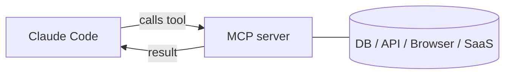

<LevelBadge level="advanced" />

<VerifyNote lastVerified="2026-06-23" source="https://code.claude.com/docs/en/mcp">
`claude mcp` 命令、配置作用域以及传输方式会演进——请以 Claude Code 官方 MCP 文档以及 modelcontextprotocol.io 为准。
</VerifyNote>

**模型上下文协议（MCP）** 是一个把 AI 连接到外部工具和数据的开放标准。一个 **MCP 服务器** 暴露各种能力（查询数据库、打开一个 GitHub PR、驱动浏览器）；Claude Code 连接到它，就能在会话中 **调用那些工具**。这就是你把 Claude 扩展到文件系统和 shell 之外的方式。

<Callout type="objectives" items={["说明什么是 MCP 服务器，以及 Claude Code 如何调用它的工具", "区分两种传输方式：本地 stdio 与远程 HTTP/SSE", "用 claude mcp add 添加一个服务器，并读懂它写入的 JSON", "为「谁能看到某个服务器」选择正确的作用域（local、project、user）", "把一个真实的数据库端到端地连接到 Claude", "避开困扰大多数人的安全与配置陷阱"]} />

## 它的大致形态



你声明 Claude 可以使用哪些服务器；每个服务器发布一组带 schema 的工具；Claude 像挑选和调用任何其他工具一样挑选并调用它们。

<Flashcards title="MCP 词汇表" cards={[{front: "模型上下文协议（MCP）", back: "一个把 AI 连接到外部工具和数据的开放标准。"}, {front: "MCP 服务器", back: "一个把各种能力（查询数据库、打开一个 GitHub PR、驱动浏览器）暴露为可调用工具的程序。"}, {front: "工具", back: "MCP 服务器随 schema 一起发布的一种能力；Claude 像挑选和调用任何其他工具一样挑选并调用它。"}, {front: "传输方式", back: "Claude 触达服务器的方式：stdio（本地进程）或远程 HTTP/SSE（托管的，通常带 OAuth）。"}, {front: "作用域", back: "谁能看到某个服务器：local（你，本项目）、project（提交后团队共享）或 user（你，到处都用）。"}]} />

## 传输方式

Claude 有两种方式触达服务器。根据服务器运行的位置来选择。

- **stdio** —— 一个由 Claude 启动的本地进程（非常适合本地工具/CLI）。
- **远程（HTTP/SSE）** —— 一个托管的服务器，通常带 OAuth。

## 配置服务器

最快的途径是 `claude mcp add` 命令——它会替你写好配置。按照下面这个顺序，从零开始连接到一个服务器。

<Steps items={[{title: "添加一个本地 stdio 服务器", body: "运行 claude mcp add —— -- 之后的所有内容都是 Claude 替你运行的启动命令。"}, {title: "或者添加一个远程 HTTP 服务器", body: "传入 --transport http 和一个作用域，然后是服务器 URL。远程服务器通常是托管的，并使用 OAuth。"}, {title: "查看已连接的内容", body: "运行 claude mcp list 来查看已配置的服务器及其连接状态。"}, {title: "检视并认证", body: "在会话内使用 /mcp 检视某个服务器的工具，并对远程服务器进行认证。"}]} />

<PromptCard title="添加一个本地 stdio 服务器">{`# A local stdio server (everything after -- is the launch command)
claude mcp add github -- npx -y @modelcontextprotocol/server-github`}</PromptCard>

<PromptCard title="添加一个远程 HTTP 服务器（与项目共享）">{`# A remote HTTP server, shared with everyone on the project
claude mcp add --transport http --scope project linear https://mcp.linear.app/mcp`}</PromptCard>

在底层这其实就是 JSON。一个 **project** 作用域的服务器落在仓库根目录的 `.mcp.json` 里——把它提交进去，你的整个团队就得到同一套工具：

```json
{
  "mcpServers": {
    "github": { "command": "npx", "args": ["-y", "@modelcontextprotocol/server-github"] }
  }
}
```

### 作用域决定谁能看到这个服务器

| 作用域 | 存放于 | 用于 |
|---|---|---|
| `local`（默认） | 你的用户设置，仅限本项目 | 个人试验、机密信息 |
| `project` | 仓库中的 `.mcp.json`（已提交） | 整个团队都该共享的工具 |
| `user` | 你的用户设置，所有项目 | 你想到处都用的服务器 |

运行 `claude mcp list` 查看已连接的内容，在会话内运行 `/mcp` 来检视工具并对远程服务器进行认证。可复制粘贴的起始模板见 [MCP 配置与服务器脚手架](/docs/templates/mcp-config)。

## 实战示例：把你的数据库交给 Claude

假设你想让 Claude 针对一个本地 Postgres 回答问题，而不是你去粘贴查询结果。添加这个服务器（project 作用域，这样队友也能继承）：

<PromptCard title="以 project 作用域添加一个 Postgres 服务器">{`claude mcp add --scope project db -- npx -y @modelcontextprotocol/server-postgres "postgresql://localhost/app"`}</PromptCard>

现在在会话里，你可以用自然语言提出问题，让 Claude 替你完成查询循环：

<PromptCard title="针对数据库提出一个问题">{`How many users signed up last week? Check the DB.`}</PromptCard>

Claude 调用该服务器的 `query` 工具，拿回数据行，然后作答——没有复制粘贴的循环。因为它是 project 作用域的，一个拉取了仓库的队友在打开 Claude Code 的那一刻就获得了同样的能力。如果你只想要读，就让连接字符串保持只读。

## 信任与安全

<Callout type="warning" items={["一个 MCP 服务器会运行代码，能读取数据并采取行动——只连接你信任的服务器。", "给每个服务器分配它所需的最小权限。", "服务器返回的任何外部内容都可能携带提示注入。", "在连接第三方服务器之前先审查它们。"]} />

:::warning 把 MCP 服务器当作安装软件来对待
一个 MCP 服务器会运行代码，能读取数据并采取行动。只连接你信任的服务器，给它们所需的 **最小权限**，并记住它们返回的任何外部内容都可能携带 [提示注入](/docs/security/prompt-injection)。先审查第三方服务器——见 [审查第三方代码](/docs/security/reviewing-third-party-code)。
:::

## 应用里也有 MCP

MCP 同样为 Claude 应用里的 **连接器（Connectors）** 提供动力——同一个标准，不同的载体。见 [应用中的连接器（MCP）](/docs/claude-app/connectors)，至于 API 部分，见 [MCP 与连接工具](/docs/api/mcp)。

## 常见错误

- **作用域错了。** 一个以 `local` 作用域添加的服务器不会对队友出现；一个你只想自己用的，不该以 `project` 作用域提交。要有意识地选择。
- **服务器太多、工具太多。** 每个连接的服务器都会把它的工具 schema 加进上下文。连接任务所需的，而非你的整份目录。
- **权限过高的连接。** 给数据库服务器一个只读角色，除非 Claude 确实需要写。MCP 把能力变成现实——把它们的范围收窄。
- **忘了注入风险。** 服务器返回的任何东西（一个网页、一个 issue 正文、一行数据）都是不可信文本，可能携带 [提示注入](/docs/security/prompt-injection)。不要在没有想清楚的情况下，把一个强大的、能写的服务器接在一个不可信的、能读的服务器旁边。

<Quiz title="自我检测" questions={[{q: "哪种传输方式是由 Claude 自己启动的本地进程？", options: ["远程 HTTP/SSE", "stdio", "OAuth"], answer: 1, explain: "stdio 是一个由 Claude 启动的本地进程——非常适合本地工具和 CLI。远程 HTTP/SSE 是一个托管的服务器，通常带 OAuth。"}, {q: "一个 project 作用域的服务器会被写到哪里，好处是什么？", options: ["你的用户设置；只有你能看到它", "仓库根目录的一个 .mcp.json；把它提交进去，整个团队就得到同一套工具", "一个隐藏的全局缓存；谁也无法编辑它"], answer: 1, explain: "project 作用域落在仓库根目录中一个已提交的 .mcp.json 里，所以拉取了仓库的队友会继承同一套工具。"}, {q: "当 Claude 只需要读的时候，为什么要让数据库连接保持只读？", options: ["这会让查询跑得更快", "最小权限——MCP 把能力变成现实，所以除非确实需要，否则不要授予写权限", "协议要求必须只读"], answer: 1, explain: "给服务器分配它所需的最小权限。MCP 把能力变成现实，所以一个只读角色可以避免意外的写入。"}]} />

<Callout type="takeaways" items={["MCP 是一个开放标准；一个 MCP 服务器暴露各种工具，Claude Code 像调用任何其他工具一样调用它们。", "两种传输方式：本地 stdio（由 Claude 启动的进程）和远程 HTTP/SSE（托管的，通常带 OAuth）。", "claude mcp add 替你写好配置；底层就是 JSON，而 project 作用域存放在一个已提交的 .mcp.json 里。", "作用域控制可见性：local（你，本项目）、project（为团队提交）、user（你，到处都用）。", "把服务器当作安装软件来对待：信任、最小权限，并提防它们返回的任何内容中的提示注入。"]} />

## 下一步

- [构建并接入你的第一个 MCP 服务器（实战演练）](/docs/walkthroughs/first-mcp-server)
- [MCP 配置与服务器脚手架](/docs/templates/mcp-config)
- [保护智能体与工具](/docs/security/securing-agents)
