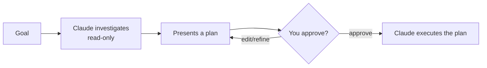

<LevelBadge level="beginner" />

<Callout type="objectives" items={["解释规划模式做什么，以及它为什么是只读的", "判断何时该先规划、何时可以跳过", "走一遍调查—提案—批准—执行的循环", "区分规划模式与权限，并把两者配合使用"]} />

<VerifyNote lastVerified="2026-06-20" source="https://code.claude.com/docs/en">
进入规划模式的方式（快捷键/标志）在不同版本间可能变化——请查阅 Claude Code 官方文档。
</VerifyNote>

## 核心理念

想象一下，是把房子钥匙直接交给承包商，还是先请他走一遍并写下他*打算*改动*什么*。规划模式就是这趟走查。

**规划模式**让 Claude Code 变为**只读**：它可以浏览你的代码库、运行搜索、进行推理——但它**不会编辑文件或运行改变状态的命令**。相反，它产出一份方案并等待你的批准。

<Callout type="tip" items={["只读意味着 Claude 只思考、不动手——在你说开始之前，不编辑文件、不运行改变状态的命令。"]} />

## 为什么它是最安全的起步方式

对于任何大型、有风险或不熟悉的事情，你都会想在 Claude 触碰你的仓库之前看清它*打算*做什么。规划模式把**思考**和**动手**分开：

回报是：你能在错误的假设变成错误的代码*之前*就抓住它们。

## 何时使用

<Callout type="tip" items={["对于大型或跨多文件的改动、迁移或重构，总是使用", "当你在一个尚未完全熟悉的代码库里工作时", "当你想要一份可审阅的方案、好与队友分享时"]} />

对于细小、显而易见的编辑，你可以跳过它——但拿不准时，先规划。

## 实践中如何工作

跟着这个循环走。每一步都为下一步铺路——只有在你批准*之后*，Claude 才会切换到编辑。

<Steps items={[{title: "进入规划模式并陈述你的目标", body: "切换到只读模式，然后描述你想达成什么。"}, {title: "Claude 进行调查", body: "它读取相关文件并提出澄清问题。"}, {title: "Claude 返回一份逐步方案", body: "要改哪些文件、采用什么方法、以及如何验证结果。"}, {title: "你批准或要求改进", body: "只有在批准之后，Claude 才切换到进行改动。"}]} />

### 自己动手试试

把下面这段复制到一个真实的规划会话里，看着这个循环跑起来：

<PromptCard title="启动一次规划会话">{`I want to migrate our auth from sessions to JWT. Stay in Plan Mode: investigate the current setup, ask anything you need, then propose a step-by-step plan with files to change and how to verify — don't edit anything yet.`}</PromptCard>

:::tip 与 CLAUDE.md 搭配
一份好的 [CLAUDE.md](/docs/claude-code/claude-md) 能让方案更精准——Claude 在规划时就已把你的约定和护栏考虑在内。
:::

## 规划模式 vs 权限

一个经典的混淆点。它们解决不同的问题，且协同工作：

- **规划模式** = "先调查并提方案，暂不动手。"（本页内容。）
- **[权限](/docs/claude-code/permissions)** = 一旦动手，*哪些*操作可以不经询问就执行。

可以这样想：**现在是否要动手**（规划模式）对比**一旦动手哪些操作被允许**（权限）。

<Flashcards cards={[{front: "规划模式让 Claude Code 处于什么状态？", back: "只读——它可以浏览、搜索和推理，但在你批准之前不会编辑文件或运行改变状态的命令。"}, {front: "规划模式的循环是什么？", back: "调查（只读）→ 呈现方案 → 你批准或要求改进 → Claude 执行。"}, {front: "什么时候该用规划模式？", back: "对于大型、有风险或不熟悉的工作（跨多文件改动、迁移、重构、陌生代码库）默认使用。只有细小、显而易见的编辑才跳过。"}, {front: "规划模式 vs 权限？", back: "规划模式管的是现在是否要动手；权限管的是一旦动手哪些操作被允许。"}]} />

<Callout type="takeaways" items={["规划模式是只读的：Claude 浏览并提方案，但在你批准之前绝不编辑文件或运行改变状态的命令", "对于大型、有风险或不熟悉的工作默认使用它；只有细小显而易见的编辑才跳过", "循环是调查到提案到批准/改进到执行", "规划模式管的是现在是否要动手；权限管的是一旦动手哪些操作被允许"]} />

<Quiz title="自测一下" questions={[{q: "在规划模式下 Claude Code 能做什么？", options: ["编辑文件并运行任何命令", "浏览、搜索和推理——但不编辑文件、不运行改变状态的命令", "只回答问题，完全无法访问文件"], answer: 1, explain: "规划模式是只读的：Claude 可以浏览代码库、运行搜索、进行推理，但它不会编辑文件或运行改变状态的命令。"}, {q: "什么时候该用规划模式？", options: ["只在修一行错别字时", "对于大型或跨多文件的改动、迁移、重构，或不熟悉的代码库", "永远不用——它只会拖慢你"], answer: 1, explain: "对于大型或跨多文件的改动、迁移或重构，以及在尚未完全熟悉的代码库里工作时，总是使用它。细小显而易见的编辑可以跳过。"}, {q: "规划模式循环的正确顺序是什么？", options: ["执行，然后调查，然后批准", "调查（只读），呈现方案，你批准或改进，然后 Claude 执行", "先批准，然后 Claude 调查并编辑"], answer: 1, explain: "Claude 只读地进行调查，呈现方案，你批准或改进，只有到那时它才切换到执行方案。"}, {q: "规划模式和权限有何不同？", options: ["它们是同一功能的两个名字", "规划模式 = 调查并提方案、暂不动手；权限 = 一旦动手，哪些操作可以不经询问就执行", "权限决定是否要规划；规划模式决定编辑哪些文件"], answer: 1, explain: "规划模式把思考和动手分开。权限控制的是一旦 Claude 动手后，哪些操作可以不经询问就执行。两者协同工作。"}]} />

## 下一步

- [权限与权限模式](/docs/claude-code/permissions)
- [上下文管理](/docs/claude-code/context-management)——让长会话保持高效
- [实战演练：为真实仓库定制 Claude Code](/docs/walkthroughs/customize-claude-code)
