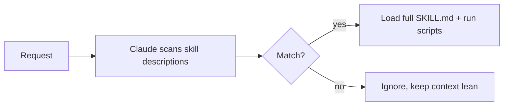

<LevelBadge level="advanced" />

<VerifyNote lastVerified="2026-06-23" source="https://code.claude.com/docs/en/skills">
技能文件的布局、渐进式披露，以及技能的运行位置（Claude Code、Claude.ai、Cowork）都还在演进中 —— 请在官方 Skills 文档中确认。
</VerifyNote>

<Callout type="objectives" items={["定义什么是技能（Skill），以及它与把所有内容都塞进 CLAUDE.md 有何不同", "读写一份 SKILL.md —— frontmatter 加指令 —— 并理解为什么 description 就是触发器", "解释渐进式披露，以及为什么它能让大量技能扩展而不撑爆上下文", "了解技能存放的三个位置：个人、项目，以及打包在插件中", "在技能、斜杠命令、子代理和 MCP 之间做出正确选择", "避开让技能无法触发的四个常见错误"]} />

**技能（Skill）** 打包了专长 —— 指令外加可选的脚本和资源 —— Claude **只在相关时才加载**它。与其把所有内容都塞进 [CLAUDE.md](/docs/claude-code/claude-md)，不如给 Claude 一个能按需取用的能力库。

## 结构剖析

一个技能就是一个包含 `SKILL.md` 的文件夹：YAML frontmatter + 指令。

```markdown
---
name: pdf-forms
description: Use when the user needs to fill, read, or generate PDF forms.
---

# PDF Forms
Steps and rules for working with PDF forms…
(optionally reference scripts/ or resources/ in this folder)
```

<Callout type="tip" items={["description 就是触发器 —— Claude 读取它来决定何时激活该技能。把它写成「Use when…」，具体到足以在恰当的时机加载，而非其他时候。"]} />

## 渐进式披露（技能为何能扩展）

Claude 并不会一上来就加载每个技能的完整正文 —— 它看到的是轻量级的 `name` + `description`，只有当某个请求匹配时才拉入完整指令（并运行脚本）。这样即便装了很多技能，上下文也能保持精简。



## 它们存放在哪里

<Steps items={[{title:"个人", body:"~/.claude/skills/<name>/SKILL.md —— 归你所有，在你所有项目中都可用。"},{title:"项目（可共享）", body:".claude/skills/<name>/SKILL.md —— 提交到 git，整个团队就都获得了这项能力。"},{title:"打包在插件中", body:"把技能打包进插件以便团队分发。参见「插件与市场」。"}]} />

AILmanac 自带 [7 个现成的技能包](/docs/templates/skills) —— 复制一个进来试试。

## 实战示例：一个能自我触发的技能

创建 `~/.claude/skills/release-notes/SKILL.md`：

```markdown
---
name: release-notes
description: Use when the user asks to write release notes or a changelog from git history.
---

# Release Notes
1. Run `git log <last-tag>..HEAD --oneline` to get the commits.
2. Group them into Features / Fixes / Breaking changes.
3. Write user-facing notes — what changed for *users*, not commit messages.
4. Output Markdown ready to paste into a GitHub release.
```

之后你输入下面这条提示。Claude 的上下文里从未有过这些步骤 —— 但请求匹配了 `description`，于是它拉入完整的 `SKILL.md`、运行 `git log`，并生成分组的发布说明。你没有按名字调用任何东西；**是 description 完成了路由**。在同一文件夹里加一个 `scripts/` 文件，技能就能在第 1 步中运行它。

<PromptCard title="按意图触发技能 —— 无需点名">{`Draft release notes since v1.4.`}</PromptCard>

## 技能 vs 命令 vs 子代理 vs MCP

| 工具 | 它是什么 | 由你还是 Claude 触发 |
|---|---|---|
| [斜杠命令](/docs/claude-code/slash-commands) | 一段保存好的提示 | **你**来调用它 |
| **技能** | 按需的专长 + 脚本 | **Claude** 在相关时加载它 |
| [子代理](/docs/claude-code/subagents) | 一个拥有自己上下文的受委派代理 | Claude 委派 |
| [MCP](/docs/claude-code/mcp) | 与外部工具/数据的连接 | 提供可调用的工具 |

<Callout type="takeaways" items={["你想按需主动触发它 → 斜杠命令。", "Claude 应当知道某套流程并在相关时应用它 → 技能。", "工作应当在一个独立的上下文中进行 → 子代理。", "你需要触达一个外部系统 → MCP。"]} />

## 常见错误

<Callout type="warning" items={["一个不触发的 description。「Helps with PDFs」太含糊；「Use when the user needs to fill, read, or generate PDF forms」则明确告诉 Claude 何时加载它。description 就是整个激活机制 —— 为匹配而写，而不是为人类而写。", "改而把所有内容塞进 CLAUDE.md。CLAUDE.md 每个会话都会加载，并且始终消耗上下文；而技能只在相关时加载。把因情境而异的流程移进技能，让 CLAUDE.md 保留那些始终为真的项目规则。", "一个庞大的技能。许多个小而描述精准的技能比一个包揽一切的更能正确路由 —— 渐进式披露只有在每个 description 都很具体时才有帮助。", "忘了它是可共享的。提交到 git 的 .claude/skills/ 中的项目技能会让整个团队获得该能力；而 ~/.claude/skills/ 中的个人技能只归你所有。"]} />

## 回顾术语

<Flashcards cards={[{front:"什么是技能（Skill）？", back:"一个包含 SKILL.md 的文件夹，打包了指令外加可选的脚本和资源，Claude 只在相关时才加载它。"},{front:"技能的触发器是什么？", back:"description 字段 —— Claude 读取它来决定何时激活该技能。把它写成「Use when…」，具体到足以在恰当的时机加载，而非其他时候。"},{front:"什么是渐进式披露？", back:"Claude 一上来只看到轻量级的 name + description，只有当请求匹配时才拉入完整的 SKILL.md（并运行脚本）—— 即便装了很多技能也能保持上下文精简。"},{front:"个人技能与项目技能的存放位置？", back:"个人：~/.claude/skills/<name>/SKILL.md（归你所有）。项目：.claude/skills/<name>/SKILL.md（提交到 git 与团队共享）。"},{front:"技能 vs 斜杠命令？", back:"斜杠命令由你按需调用；技能由 Claude 在请求匹配其 description 时自动加载。"},{front:"技能 vs CLAUDE.md？", back:"CLAUDE.md 每个会话都加载且始终消耗上下文；技能只在相关时加载。把始终为真的规则放在 CLAUDE.md 里，把因情境而异的流程放在技能里。"}]} />

## 自我检测

<Quiz title="自我检测" questions={[{q:"在一份 SKILL.md 中，究竟是什么决定了 Claude 何时激活该技能？", options:["文件夹名称","frontmatter 中的 description 字段","正文里的第一个标题","用户手动调用"], answer:1, explain:"description 就是触发器 —— Claude 读取它来决定何时激活该技能。把它写成「Use when…」，具体到足以在恰当的时机加载。"},{q:"什么是渐进式披露？", options:["Claude 一上来就加载每个技能的完整正文","Claude 一上来只看到 name + description，只有当请求匹配时才加载完整的 SKILL.md","技能向用户逐行揭示它的步骤","CLAUDE.md 在一个会话中被逐步加载"], answer:1, explain:"渐进式披露意味着 Claude 看到的是轻量级的 name + description，只有当请求匹配时才拉入完整指令（并运行脚本）—— 即便装了很多技能也能保持上下文精简。"},{q:"你想让整个团队通过 git 获得某项能力。该把技能放在哪里？", options:["~/.claude/skills/<name>/SKILL.md","/etc/claude/skills/","提交到 git 的 \.claude/skills/<name>/SKILL.md","放进 CLAUDE.md 里"], answer:2, explain:"提交到 git 的 .claude/skills/ 中的项目技能会让整个团队获得该能力；而 ~/.claude/skills/ 中的个人技能只归你所有。"},{q:"你想自己按需、按名字主动触发某个东西。哪个工具合适？", options:["技能","斜杠命令","子代理","MCP"], answer:1, explain:"经验法则：你想按需主动触发它 → 斜杠命令。Claude 在相关时加载某套流程 → 技能；独立上下文 → 子代理；触达外部系统 → MCP。"},{q:"为什么宁可用技能，也不把因情境而异的流程放进 CLAUDE.md？", options:["CLAUDE.md 不能包含流程","CLAUDE.md 每个会话都加载且始终消耗上下文，而技能只在相关时加载","技能比 CLAUDE.md 运行得更快","CLAUDE.md 无法通过 git 共享"], answer:1, explain:"CLAUDE.md 每个会话都会加载且始终消耗上下文；而技能只在相关时加载。把因情境而异的流程移进技能，让 CLAUDE.md 保留那些始终为真的项目规则。"}]} />

## 下一步

- [编写你的第一个技能（详解）](/docs/walkthroughs/first-skill)
- [SKILL.md 模板](/docs/templates/skills)
- [插件与市场](/docs/claude-code/plugins-marketplaces)
