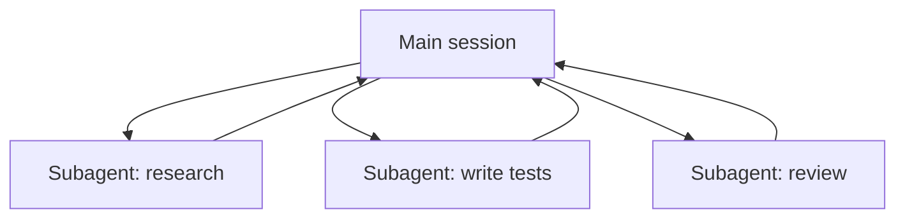

<LevelBadge level="advanced" />

<VerifyNote lastVerified="2026-06-23" source="https://code.claude.com/docs/en/sub-agents">
子智能体的 frontmatter 字段、内置智能体清单以及 `/agents` 界面会随时间变化——请在官方文档中确认。
</VerifyNote>

<Callout type="objectives" items={["什么是子智能体——一个独立的 Claude，拥有自己的上下文窗口和一组受限的工具","委派的三个理由：保护上下文、专门化、并行化","Claude 已经会自动委派的内置智能体：Explore、Plan、General-purpose","如何在 .claude/agents/ 中定义你自己的子智能体，以及为什么 description 与 tools 是两个起决定作用的字段","何时不该并行化，以及它如何与 API 智能体和舰队级工作流相联系"]} />

一个**子智能体**是一个独立的 Claude 实例，拥有**自己的上下文窗口**和一组**受限的工具**，你的主会话把一块工作委派给它。它回报的是一个结果，而非它的整段记录——因此主会话保持聚焦、不被杂乱拖累。

## 为什么要委派

三项职责，一个工具。每次你伸手去用子智能体时都要记住这些：

- **保护主上下文。** 一次研究深挖或一次大文件扫读可能烧掉数千 token；在子智能体里做，只有结论会返回。
- **专门化。** 给子智能体一个量身定制的系统提示，并只给它所需的工具（例如一个只读的审查者）。
- **并行化。** 同时运行互相独立的子任务——例如同时探查三个模块。

## 你已经拥有的内置智能体

在你定义自己的之前，先要知道 Claude Code 自带了一些会自动委派的子智能体：

| 内置智能体 | 它的作用 |
| --- | --- |
| **Explore** | 一个快速、只读的智能体（运行在更便宜的模型上），用于在不触碰代码库的情况下搜索和理解它。 |
| **Plan** | 在 plan 模式期间收集上下文，让研究工作不进入主要的、只读的对话。 |
| **General-purpose** | 一个拥有完整工具的智能体，用于混合了探索与改动的复杂、多步骤工作。 |

你很少会按名字调用它们；当任务匹配时 Claude 会自行选用。自定义子智能体是为那些*你*反复用同样的指令重新创建的工作者准备的。

## 如何定义你自己的

子智能体是一个带 YAML frontmatter 的 Markdown 文件（正文成为它的系统提示）。只有 `name` 和 `description` 是必填的；其余都是可选的。可以按项目存放在 `.claude/agents/`（把它提交进 git，这样团队就能共享），或按用户存放在 `~/.claude/agents/`。用 `/agents` 命令创建，或手动创建。

<Steps items={[{title: "选择一个位置", body: "按项目放在 .claude/agents/（提交它，这样团队就能共享），或按用户放在 ~/.claude/agents/。"},{title: "创建文件", body: "用 /agents 命令，或手动写一个带 YAML frontmatter 的 Markdown 文件。"},{title: "设置必填字段", body: "只有 name 和 description 是必填的。其余都是可选的。"},{title: "把正文写成系统提示", body: "frontmatter 下方的 Markdown 正文成为子智能体的系统提示。"},{title: "收窄工具范围", body: "加上一个 tools 允许清单，让子智能体只能做它的职责所需的事。"}]} />

一个入门级的 `code-reviewer` 子智能体：

<PromptCard title="code-reviewer 子智能体（.claude/agents/code-reviewer.md）">{`---
name: code-reviewer
description: Expert code reviewer. Use proactively after code changes.
tools: Read, Glob, Grep
model: sonnet
---

You are a senior reviewer. Read the changed files, then report only
high-confidence issues: correctness bugs, security risks, and missing
tests. For each, show the file:line, the problem, and a concrete fix.
Do not restate what the code does. Never edit files.`}</PromptCard>

让一个子智能体出色的有两件事：

- **`description` 是路由信号。** Claude 读取它来决定*何时*委派，所以要把它写得像一个触发器——“Use proactively after code changes”会自动把它拉进来；而含糊的“helps with code”则不会。这是文件里杠杆率最高的一行。
- **把工具范围收得很紧。** `tools` 字段是一个允许清单（或者用 `disallowedTools` 作为拒绝清单）。一个只能 `Read, Glob, Grep` 的审查者*不可能*意外编辑你的代码——这个限制是一种保证，而非一个提示。省略 `tools`，子智能体就会继承主会话拥有的一切。

## 实战示例：并行审查的扇出

你刚完成了一个改动了三个模块的功能，想对每个模块做一次快速、独立的检查。在你的主会话里：

<PromptCard title="一次性扇出三个审查者">{`Review the changes in auth/, billing/, and api/ — use the code-reviewer subagent on each, in parallel.`}</PromptCard>

Claude 一次性派生出三个 `code-reviewer` 实例。每个只读取自己的模块，把上下文烧在文件内容上，然后返回一份简短的发现清单。你的主会话从不看到原始 diff——只看到三份整洁的报告——而整件事大约在最慢那一个审查实例所需的时间内完成，而非三者之和。因为审查者是只读的，三个同时工作的智能体不会在写入上发生冲突。

## 何时不该并行化

<Callout type="warning" items={["有依赖关系的步骤必须串行——别把步骤 B 需要步骤 A 输出的工作扇出去做。","共享的文件写入可能冲突；把它们隔离开（见 Git 工作树）或串行化。","对于小任务，协调开销可能超过收益。当子任务规模可观且互相独立时再委派。"]} />

关于隔离冲突的写入，见 [Git 工作树](/docs/claude-code/worktrees)。

## 子智能体 vs API/SDK 中的“智能体”

本页讲的是 Claude Code 内建的委派。以编程方式构建*你自己的*智能体见[在 API 上构建智能体](/docs/api/building-agents)。其心智模型——一个目标、一个工具循环、隔离的上下文——是一样的。

## 常见错误

<Flashcards title="陷阱——翻转每张卡片看修正方法" cards={[{front: "含糊的 description", back: "如果它没说何时该用这个子智能体，Claude 就不会在恰当的时机委派（或干脆不委派）。以“Use when…”/“Use proactively after…”开头。"},{front: "把工具完全敞开", back: "一个用来审查的子智能体不应该能写入。允许清单把意图变成保证。"},{front: "指望共享记忆", back: "子智能体得到的是它的 description、它的系统提示，以及你交给它的任务——而非你的主对话。在委派时把它所需的上下文传过去。"},{front: "把有依赖关系的工作扇出去", back: "并行只对互相独立的子任务有帮助；如果 B 需要 A 的输出，就按顺序运行它们。"}]} />

## 当少数几个智能体还不够时

每一轮委派少数几个子智能体是本页的看家本领。当一个任务需要**数十甚至数百个**智能体——一次覆盖整个代码库的扫读、一次 500 个文件的迁移、跨多个来源交叉核对的研究——这种编排会超出单个上下文窗口的承载能力。这正是[动态工作流与 ultracode](/docs/claude-code/dynamic-workflows)的用武之地：Claude 写一个脚本来承载计划，由一个运行时在后台把智能体扇出去。

<Quiz title="自我检测" questions={[{q: "子智能体 frontmatter 中的哪个字段是 Claude 读取以决定何时委派的路由信号？", options: ["name", "description", "model"], answer: 1, explain: "description 是杠杆率最高的一行——Claude 读取它来决定何时委派。要把它写得像一个触发器，例如“Use proactively after code changes”。"}, {q: "给一个审查者子智能体配了 tools: Read, Glob, Grep。这个允许清单保证了什么？", options: ["它运行在更便宜的模型上", "它不可能意外编辑你的代码", "它继承主会话的工具"], answer: 1, explain: "tools 字段是一个允许清单，所以一个被限制在 Read、Glob、Grep 的审查者无法写入——这个限制是一种保证，而非一个提示。省略 tools 则会继承一切。"}, {q: "什么时候并行化子智能体没有帮助？", options: ["当子任务互相独立且规模可观时", "当步骤 B 需要步骤 A 的输出时", "当每个智能体读取不同的模块时"], answer: 1, explain: "有依赖关系的步骤必须串行运行。并行只对互相独立的子任务有帮助；如果 B 需要 A 的输出，就按顺序运行它们。"}]} />

<Callout type="takeaways" items={["子智能体是一个独立的 Claude，拥有自己的上下文窗口和受限的工具；它返回的是一个结果，而非它的记录。","委派是为了保护主上下文、为了专门化，或为了并行化互相独立的工作。","Claude 已经自带 Explore、Plan 和 General-purpose 内置智能体，并会自动选用它们。","name 和 description 是仅有的必填 frontmatter 字段——而 description 是决定 Claude 何时委派的路由信号。","tools 允许清单把意图变成保证；只扇出互相独立的子任务，并隔离共享的写入。"]} />

## 下一步

- [动态工作流与 ultracode](/docs/claude-code/dynamic-workflows) — 在舰队规模上编排子智能体
- [设计多子智能体工作流（实战演练）](/docs/walkthroughs/multi-subagent-workflow)
- [上下文管理](/docs/claude-code/context-management)
- [Git 工作树](/docs/claude-code/worktrees)
