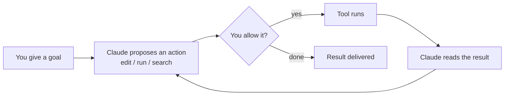

<LevelBadge level="beginner" />

<VerifyNote lastVerified="2026-06-20" source="https://code.claude.com/docs/en/overview">
安装命令和具体的功能集经常变化。请将 Claude Code 官方文档视为安装配置的权威来源。
</VerifyNote>

<Callout type="objectives" items={["解释是什么让 Claude Code 成为智能体，而不只是一个聊天窗口", "在脑中描绘出智能体循环：目标、行动、许可、观察、重复", "说出 Claude Code 运行的各个端，以及设置如何随你迁移", "按收益高低为你要配置的内容排序，从 CLAUDE.md 开始", "走一遍使用规划模式进行安全首次会话的流程"]} />

**Claude Code** 是 Anthropic 推出的*智能体式*编程工具。与聊天窗口不同，它能真正在你的项目里**做事**：读写文件、运行 shell 命令、搜索代码库、调用外部工具——而这一切都需经过你的许可。

## 心智模型：智能体循环

这是让其他一切都讲得通的核心理念。你用自然语言给出一个目标（"给 auth 模块加测试，并修复失败项"）。Claude 会**规划、执行、观察结果，然后重复**，直到达成目标。你通过[权限](/docs/claude-code)和[规划模式](/docs/claude-code)始终掌控全局。

<Callout type="tip" items={["循环只在你许可的行动上向前推进。没有任何编辑或运行会绕过那道许可关卡——这正是接下来各节如此重要的原因。"]} />

## 你可以在哪里运行它

同一个 Claude Code 会跟随你跨越各个端——它在你工作的任何地方都**共享你的设置、钩子和权限**。

- **终端（CLI）**——最初的形态；可在任何 shell 中使用。
- **IDE 扩展**——VS Code 和 JetBrains，支持内联 diff。
- **桌面端与网页端**——并且它会在各个端之间共享你的设置、钩子和权限。

## 你将配置哪些内容（大致按收益高低排序）

把它想象成一架梯子：先掌握顶端的横档，等到出现真正的需求时再叠加高阶功能。

<Steps items={[{title: "CLAUDE.md", body: "持久化的项目指令。收益最高、投入最低——从这里开始。"}, {title: "规划模式", body: "在任何编辑执行之前先调查并提出方案。"}, {title: "权限", body: "决定 Claude 无需询问即可执行的操作。"}, {title: "settings.json", body: "支撑一切之下的完整配置系统。"}, {title: "高阶功能", body: "斜杠命令、钩子、技能、子智能体和 MCP 服务器——在你需要时逐层叠加。"}]} />

每一根横档都通向各自的课程：[CLAUDE.md](/docs/claude-code)、[规划模式](/docs/claude-code)、[权限](/docs/claude-code)、[settings.json](/docs/claude-code)、[斜杠命令](/docs/claude-code)、[钩子](/docs/claude-code)、[技能](/docs/claude-code)、[子智能体](/docs/claude-code)，以及 [MCP 服务器](/docs/claude-code)。

## 你的第一次会话（大致流程）

<Steps items={[{title: "安装并完成身份认证", body: "当前命令请参见官方文档。"}, {title: "打开一个项目", body: "cd 进入某个项目并启动 Claude Code。"}, {title: "生成一份初始的 CLAUDE.md", body: "运行 /init 来搭建你的项目指令。"}, {title: "提一个小而具体的请求", body: "试试：解释这个应用里路由是怎么工作的。"}, {title: "先在规划模式下做一次改动", body: "审阅提出的方案，然后让它执行。"}]} />

从第一次会话中值得记住的两个命令：

<PromptCard title="搭建项目指令">{`/init`}</PromptCard>

<PromptCard title="一个安全的、只读的首次请求">{`Explain how routing works in this app.`}</PromptCard>

当前的安装和身份认证命令，请参见[官方文档](https://code.claude.com/docs/en/overview)。

<Callout type="tip" items={["从只读开始。做第一个真实任务时，请使用规划模式——Claude 会进行调查并向你展示方案，而不会触碰文件。这是建立信任最安全的方式。"]} />

## 关键术语速览

<Flashcards title="Claude Code 词汇表" cards={[{front: "智能体式工具", back: "一种会在你的项目里采取行动的工具——读写文件、运行命令、搜索代码、调用外部工具——而不只是一个聊天窗口。"}, {front: "智能体循环", back: "用自然语言给出目标，然后 Claude 规划、执行、观察结果，并重复，直到达成目标。"}, {front: "规划模式", back: "Claude 在任何编辑执行之前先调查并提出方案——最安全的起步方式。"}, {front: "CLAUDE.md", back: "持久化的项目指令。收益最高、投入最低；用 /init 生成。"}, {front: "权限", back: "控制关卡：Claude 无需先询问你即可执行的操作。"}]} />

<Quiz title="自我检测" questions={[{q: "是什么让 Claude Code 区别于聊天窗口？", options: ["它会写出更长的回答", "它能在你的项目里采取行动——编辑文件、运行命令、搜索代码——并经过你的许可", "它只能在终端里工作"], answer: 1, explain: "Claude Code 是智能体式的：它会在你的项目里行动（读写文件、运行 shell 命令、搜索、调用工具），而这一切都经过你的许可。"}, {q: "在智能体循环中，Claude 提出某个行动之后紧接着会发生什么？", options: ["工具自动运行", "由你决定是否允许它", "结果被交付"], answer: 1, explain: "每一个提出的行动都要经过一道许可关卡——只有你允许，工具才会运行。"}, {q: "哪一个配置步骤是投入最低、收益最高的？", options: ["MCP 服务器", "钩子", "CLAUDE.md"], answer: 2, explain: "CLAUDE.md——持久化的项目指令——被列在最前面，因为它以最低的投入带来最高的收益。"}]} />

<Callout type="takeaways" items={["Claude Code 是智能体式的：它经过你的许可在项目里行动，而不只是聊天。", "循环是目标、提议、许可、运行、观察、重复——你通过权限和规划模式来掌控它。", "它可在终端、VS Code/JetBrains，以及桌面端和网页端运行，并在各个端之间共享设置、钩子和权限。", "按收益配置：先 CLAUDE.md，然后是规划模式、权限、settings.json，最后才是高阶功能。", "首次会话以只读方式在规划模式下开始，先建立信任，再让编辑执行。"]} />

## 下一步

- 收益最高的配置 → [CLAUDE.md 与记忆文件](/docs/claude-code)
- 端到端实操 → [实战演练：为真实仓库定制 Claude Code](/docs/walkthroughs)
- 构建你自己的自动化 → [模板与配方](/docs/templates)
