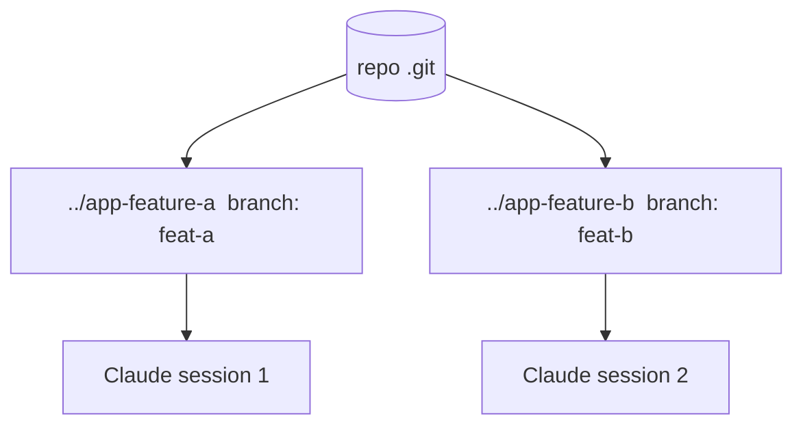

<LevelBadge level="advanced" />

<Callout type="objectives" items={["什么是 git worktree——一个仓库、多个工作目录，每个目录位于各自的分支上","它解决的确切问题：避免并行的 Claude 会话在同一批文件上相互冲突","用于添加、列出和移除 worktree 的四条命令","该技术何时物有所值——以及在合并时会咬人的三个陷阱","worktree 如何与子智能体组合：跨会话的并行 vs 单个会话内部的并行"]} />

**git worktree** 让一个仓库可以拥有**多个工作目录**，每个目录都检出到不同的分支。把它与 Claude Code 搭配使用，你就能在同一个项目上**并行运行多个会话**——每个会话编辑各自的文件，互不冲突。

## 它解决的问题

如果两个 Claude 会话同时编辑同一个工作目录，它们会因为彼此的改动而互相绊倒。worktree 为每个会话提供**各自的目录和分支**，因此并行工作在你合并之前一直保持隔离。

## 基础知识

四条命令撑起了整个工作流程：添加一个 worktree（新目录 + 新分支）、列出已有的 worktree，以及在用完后移除某个 worktree。

<Steps items={[{title: "为某个功能添加一个 worktree", body: "在你的仓库中，git worktree add ../app-feature-a -b feat-a 一次性创建一个新目录以及一个新分支。"},{title: "再为某个修复添加一个", body: "git worktree add ../app-fix-123 -b fix-123 —— 第二个隔离的目录/分支，与第一个并排存在。"},{title: "查看你拥有哪些", body: "git worktree list 会显示每个工作目录及其所在的分支。"},{title: "用完后清理", body: "git worktree remove ../app-feature-a 拆除一个 worktree，这样过期的目录就不会堆积。"}]} />

<PromptCard title="四条命令的工作流程">{`# from your repo
git worktree add ../app-feature-a -b feat-a   # new dir + new branch
git worktree add ../app-fix-123 -b fix-123
git worktree list
# when done with one:
git worktree remove ../app-feature-a`}</PromptCard>

在每个 worktree 目录中打开一个 Claude Code 会话，让它们各自独立地工作。

## 何时值得这么做

- **并行的功能/修复**，你想同时推进它们。
- **某个长时间运行的任务**在一个 worktree 中运行，同时你在另一个 worktree 中继续工作。
- **有风险的实验**，与你的主检出隔离开来。

## 陷阱

<Callout type="warning" items={["留意合并回去这一步：分支最终都会合并——冲突会在那时浮现，而不是在编辑过程中。让 worktree 保持聚焦且短命。","不要在两个 worktree 中运行带状态的共享资源（同一个开发数据库、同一个端口）而不加以区分。","用 git worktree remove 清理，这样过期的目录就不会堆积。"]} />

## Worktree vs 子智能体

这是两个不同维度的并行——它们不竞争，而是叠加。

| | 它并行化什么 | 隔离性 |
| --- | --- | --- |
| **[子智能体](/docs/claude-code/subagents)** | 在一个会话*内部*的工作（委派） | 隔离的上下文 |
| **Worktree** | *跨*多个会话在磁盘上的工作 | 隔离的分支/文件 |

它们能很好地组合：位于某个 worktree 中的一个会话，本身可以再派生出子智能体。

<Callout type="tip" items={["当你需要两个 Claude 会话同时操作同一个仓库时，使用 worktree；当一个会话需要把一块工作卸载到隔离的上下文中时，使用子智能体。"]} />

<Quiz title="自我检测" questions={[{q: "git worktree 给你带来了什么？", options: ["在单个工作目录中拥有多个分支", "一个仓库拥有多个工作目录，每个目录位于各自的分支上", "你的 .git 文件夹的一份备份副本"], answer: 1, explain: "git worktree 让一个仓库可以拥有多个工作目录，每个目录都检出到不同的分支——因此并行会话不会相互冲突。"}, {q: "哪条命令在一步之内同时创建一个新目录和一个新分支？", options: ["git worktree list", "git worktree add ../app-feature-a -b feat-a", "git worktree remove ../app-feature-a"], answer: 1, explain: "git worktree add ../app-feature-a -b feat-a 同时创建新目录和新分支。list 显示已有的 worktree；remove 拆除某一个。"}, {q: "来自并行 worktree 的合并冲突实际上何时浮现？", options: ["在两个会话编辑时持续浮现", "在合并回去时，而不是在编辑过程中", "永远不会，因为分支是隔离的"], answer: 1, explain: "在你工作时分支保持隔离，所以冲突不会在编辑过程中出现——它们在合并回去时浮现。让 worktree 保持聚焦且短命，以限制冲突。"}, {q: "worktree 与子智能体之间是什么关系？", options: ["它们是同一个功能的两个名字", "worktree 跨会话在磁盘上并行化；子智能体在一个会话内部并行化——而且它们能组合", "你必须二选一；同时使用两者会破坏隔离"], answer: 1, explain: "子智能体是一个会话内部的并行（隔离的上下文）；worktree 是跨会话在磁盘上的并行（隔离的分支/文件）。位于某个 worktree 中的一个会话本身可以再派生出子智能体。"}]} />

<Callout type="takeaways" items={["git worktree = 一个仓库、多个工作目录，每个目录位于各自的分支上——这是无冲突并行 Claude 会话的基础。","两个会话在同一个工作目录上会相互绊倒；每个会话一个 worktree 可以让文件和分支保持隔离，直到你合并。","git worktree add ../dir -b branch 创建目录 + 分支；list 显示它们；remove 进行清理。","对于并行的功能/修复、在其他工作之外长时间运行的任务，以及隔离的有风险实验，这么做是值得的。","当心合并回去这一步，不要在多个 worktree 之间共享带状态的资源（数据库、端口），并且始终清理——同时记住 worktree 能与子智能体组合。"]} />

## 下一步

- [子智能体与并行智能体](/docs/claude-code/subagents)
- [无头模式与 Agent SDK](/docs/claude-code/headless-and-agent-sdk)
- [上下文管理](/docs/claude-code/context-management)
