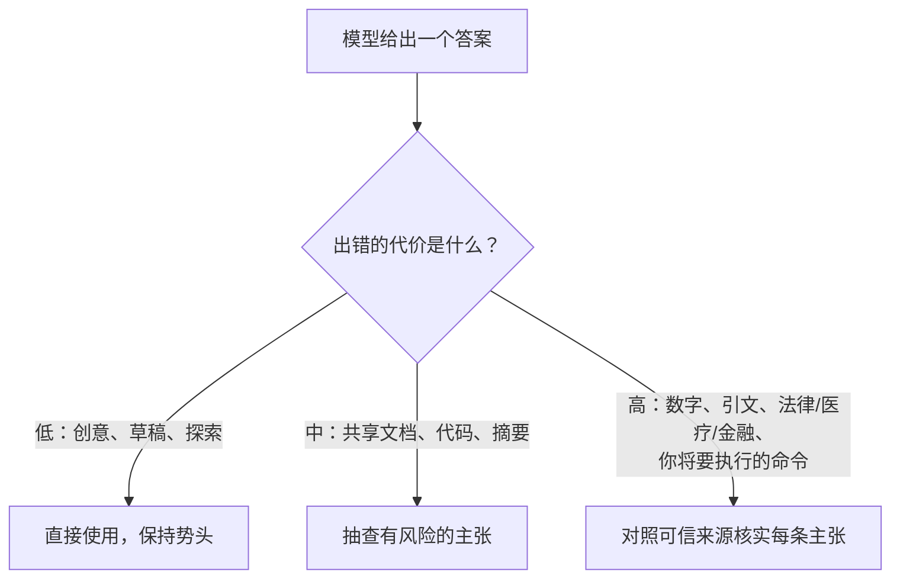

<LevelBadge level="intermediate" />

<Callout type="objectives" items={["理解模型为什么会编造出自信、措辞完整的答案", "认清你最应保持怀疑的 5 个高风险区域", "运用一套 6 部分的工具箱来大幅减少幻觉", "使用一个可复制粘贴的反幻觉提示词，它能锚定来源、给出台阶并强制要求引用", "树立一种把核实力度与出错代价相匹配的心态"]} />

**幻觉（hallucination）**指模型以十足的自信陈述某个错误的内容。它不是在撒谎，也不是坏了——这是 LLM 工作方式的另一面：它们生成*看似合理*的文本，而看似合理并不总是真的（参见 [什么是 LLM？](/docs/foundations/what-is-an-llm)）。你无法靠提示词把它完全消除，但你可以大幅减少它，并把剩下的揪出来。

## 它为什么会发生

模型预测一个可能的续写。当它"不知道"某件事时，*看起来最可能的*续写往往是一个自信、措辞完整——却错误的——答案。除非你给它留出空间，否则没有内建的"我不确定"信号。

<Callout type="tip" items={["对大多数幻觉的修复办法，就是刻意为不确定性留出空间——给模型许可，让它能说自己不知道。"]} />

## 高风险区域

当输出涉及以下内容时，最应保持怀疑：

- **引文、引述与参考文献**——捏造的论文、伪造的 URL、错误归属的引述。
- **具体的数字、日期与统计数据**——看似合理却虚构的数字。
- **冷门或非常近期的事实**——超出模型可靠学到的范围。
- **API 与库的细节**——不存在的方法或参数。
- **人物及法律/医疗细节**——风险高，且容易出现微妙的错误。

## 减少幻觉的工具箱

把这些叠加起来——每一项都有帮助：

<Steps items={[
  {title: "把它锚定在来源上", body: "粘贴源文本并说\"只根据上面的文本回答；如果文本里没有，就说没有。\"这正是 RAG (/docs/foundations/rag) 背后的核心思想。"},
  {title: "给它一个台阶", body: "明确允许\"如果你不确定，就说'我不知道'\"——这能极大减少自信的瞎猜。"},
  {title: "要求推理与引用", body: "\"引用支持每条主张的那一句原话。\"没有依据的主张就会一目了然。"},
  {title: "降低创造性", body: "对于模型暴露温度控制的事实类任务，把它调低（参见采样控制 /docs/foundations/sampling-controls）。"},
  {title: "使用工具", body: "对于数学、当前数据或查询，给模型一个计算器/搜索/工具 (/docs/api/tool-use)，而不是相信它的记忆。"},
  {title: "交叉核对", body: "用两种方式问同一个问题，或让第二轮去评判第一轮。"}
]} />

## 一段可复制粘贴的反幻觉提示词

上面工具箱里的大部分内容都可以浓缩成一个可复用的封装。把你的来源粘贴到指定位置并提出问题——它会把答案锚定在来源上、给模型一个台阶，并一次性强制要求给出引用：

<PromptCard title="反幻觉封装">{`You answer ONLY from the SOURCE below.
Rules:
- If the answer is not in the SOURCE, reply exactly: "Not stated in the source."
- After every claim, quote the exact sentence from the SOURCE that supports it.
- Do not add outside knowledge, estimates, or assumptions.

SOURCE:
"""
[paste the document, transcript, or data here]
"""

QUESTION: [your question]`}</PromptCard>

它为什么有效："来源中未提及"这个逃生出口消除了瞎猜的压力，而"引用句子"的规则让任何没有依据的主张都无处藏身。当你确实想要模型自身的知识时，就去掉 SOURCE 块——但那样核实的责任就重新落回你身上。

## 真正能保护你的心态

<Callout type="warning" items={["没有任何提示词能让输出 100% 可靠。对于任何有后果的内容——报告里的一个数字、一条引文、一个你将要执行的命令、一项医疗/法律/金融细节——都要对照可信来源去核对。把 AI 当作快速的初稿，而非最终权威。这正是负责任地使用 (/docs/security/responsible-use) 的核心。"]} />

一条简单的规则：**出错的代价决定了核实的力度。** 头脑风暴？尽管信任。发布一项统计数据？每次都核实。

<Callout type="takeaways" items={["幻觉是基于合理性生成的副产品，而不是一个你能完全靠提示词消除的 bug。", "对引文、数字/日期、冷门或近期的事实、API 细节，以及人物/法律/医疗细节，最应保持怀疑。", "把工具箱叠加起来：锚定来源、给出台阶、要求引用、降低温度、使用工具、交叉核对。", "一个封装提示词就能一次性做到锚定来源 + 给出台阶 + 强制要求引用。", "把核实力度与出错代价相匹配——代价低时尽管信任，后果重大时核实每条主张。"]} />

<Quiz title="自测一下" questions={[
  {
    q: "模型为什么会产生幻觉？",
    options: [
      "它们在故意对用户撒谎",
      "它们预测看起来最合理的续写，而它并不总是真的",
      "它们坏了，需要重新训练",
      "它们总是在答到一半时耗尽内存"
    ],
    answer: 1,
    explain: "幻觉是 LLM 工作方式的另一面：它们生成看似合理的文本，而看似合理并不总是真的。当模型不知道某件事时，看起来最可能的续写往往是自信、措辞完整、却错误的。"
  },
  {
    q: "下面哪一项是你最应保持怀疑的高风险区域？",
    options: [
      "为获取创意而进行的开放式头脑风暴",
      "改写一句你已经写好的话",
      "具体的数字、日期与统计数据",
      "询问一个你能自行核验的简单定义"
    ],
    answer: 2,
    explain: "具体的数字、日期与统计数据是一个高风险区域——它们可能看似合理却是虚构的。其他高风险区域还包括引文/引述、冷门或近期的事实、API 细节，以及人物/法律/医疗细节。"
  },
  {
    q: "给模型一个明确的台阶，比如\"如果你不确定，就说'我不知道'\"，最直接的效果是什么？",
    options: [
      "它让模型更快",
      "它能极大减少自信的瞎猜",
      "它会自动提高温度",
      "它会把模型接入实时搜索"
    ],
    answer: 1,
    explain: "明确允许模型说自己不知道，消除了产出一个自信猜测的压力，从而极大减少了幻觉式的答案。"
  },
  {
    q: "什么规则决定了一个答案需要多少核实？",
    options: [
      "答案的长度",
      "模型自述的置信水平",
      "出错的代价",
      "写这个提示词花了多长时间"
    ],
    answer: 2,
    explain: "出错的代价决定了核实的力度。头脑风暴？尽管信任。发布一项统计数据？每次都核实。"
  },
  {
    q: "在反幻觉封装提示词中，是什么让任何没有依据的主张都无处藏身？",
    options: [
      "把温度降到零",
      "要求在每条主张之后引用 SOURCE 中支持它的确切句子的规则",
      "把问题问两遍",
      "去掉 SOURCE 块"
    ],
    answer: 1,
    explain: "\"引用句子\"的规则迫使模型用 SOURCE 中的一句确切原话来支撑每条主张，因此任何并未真正得到支持的主张都会一目了然。\"来源中未提及\"这个逃生出口则消除了瞎猜的压力。"
  }
]} />

## 下一步

- [检索增强生成（RAG）](/docs/foundations/rag)
- [评估 AI 质量（Evals）](/docs/foundations/evals)
- [负责任地使用、伦理与核实](/docs/security/responsible-use)
