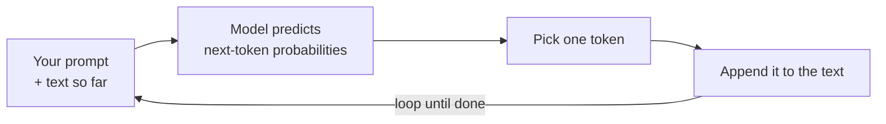

<LevelBadge level="beginner" />

**大语言模型**（Large Language Model，LLM）——也就是 Claude 背后的技术——做的其实是一件看似极其简单的事：它读取文本，然后**预测接下来会出现什么**，一次预测一小块。就这么简单。其余的一切，都是把这件事做到惊人地好之后自然涌现出来的。

<Callout
  type="objectives"
  items={[
    "掌握一句话的心智模型：大语言模型就是一种非常高级的自动补全",
    "看清模型如何在循环中一次一个词元地构建出答案",
    "理解为什么这一机制既能解释它的强项，也能解释它的怪癖",
    "知道大语言模型不是什么——以及这会如何改变你使用它的方式"
  ]}
/>

## 一句话的心智模型

> 大语言模型就是一种非常高级的自动补全：它读过海量文本，学会了语言——以及语言所承载的思想——通常会如何延续下去的规律。

当你提出一个问题时，模型并不是在“查找”答案。它是在逐个词元地生成你这段文本最合乎情理的延续（参见 [词元与上下文](/docs/foundations/tokens-and-context)）。一个好问题最合乎情理的延续，通常就是一个好答案——这正是它之所以行得通的原因。

:::tip 类比：开了挂的输入法联想
想想你手机上那个会推荐下一个词的自动补全功能。现在再想象一下，它读过互联网上几乎所有的书籍、文章和代码——而且它推荐的不只是下一个词，而是一整篇与之契合的文章、译文或程序。这就是理解大语言模型的直觉。
:::

## 一次一个词元

整个引擎就是一个循环：读取目前为止的全部内容，预测下一小块，把它接上去，再重复。

<Steps
  items={[
    {title: "读取", body: "模型把你的提示词，加上到目前为止已生成的全部内容，作为一整块文本读进去。"},
    {title: "预测", body: "它为“下一个词元可能是什么”计算出概率。"},
    {title: "挑选", body: "它选出一个词元。这一步是确定性的、还是带点随机，正是像温度（temperature）这样的采样控制项所调节的。"},
    {title: "追加并重复", body: "被选中的词元被加到文本里，这段稍微变长的文本再被送回去——如此循环，直到答案完成。"}
  ]}
/>

每一步都只预测**一个**词元，然后把稍微变长的文本再送回去。模型一开始并没有针对整段答案的计划——连贯性是把这种预测做到极好、重复成千上万次之后涌现出来的。“挑选一个词元”这一步的行为方式（贪婪选取还是带点随机），正是像温度这样的[采样控制项](/docs/foundations/sampling-controls)所调节的。

## 为什么这能解释它的强项

因为它从写作、代码和推理中学到了规律，大语言模型可以流畅地**写作、总结、翻译、解释和编程**——这些任务本质上都是“合理地把这段文本继续下去”。给它一个清晰的开头，它就能产出一段有力的延续。这就是为什么[提示词](/docs/prompting/basics)如此重要：你是在塑造它要去延续的那段文本的开头。

## 为什么这能解释它的怪癖

同样的机制也能解释它那些粗糙的边角：

- **它可能自信地犯错。** 一段听起来很流畅的延续未必就是真实的——这就是[幻觉](/docs/foundations/hallucinations)。
- **它并不真正“知道”今天发生的事实**，除非你把这些事实提供给它，或者它有工具可以去查。
- **它在不同对话之间没有记忆**，除非你给它一些。

## 大语言模型**不是**什么

:::warning 调整你的预期，你就会得到更好的结果
- ❌ **不是数据库或搜索引擎。** 它是在生成，而不是在检索经过核实的记录。
- ❌ **不是计算器。** 它能就数学进行推理，但不保证精确——这种情况要给它配工具。
- ❌ **不是人。** 没有情感、意图，也没有连续的记忆。它是一台强大的文本引擎。
:::

把它当成一位才华横溢、反应飞快、博览群书、但偶尔会记错的助手——并且对于重要的内容，要去**核实**。

## 关键术语

<Flashcards
  title="复习核心概念"
  cards={[
    {front: "LLM（大语言模型）", back: "Claude 背后的技术。它读取文本，一次一小块地预测接下来会出现什么。"},
    {front: "下一个词元预测", back: "核心循环：读取目前为止的文本，预测下一个词元，接上去，重复直到完成。"},
    {front: "词元（Token）", back: "模型每一步所预测的那一小块文本。模型永远只在一次预测一个。"},
    {front: "幻觉", back: "一段听起来流畅、但实际上并不真实的延续——这是“生成而非检索”的副作用。"},
    {front: "采样 / 温度", back: "控制“挑选一个词元”这一步的行为方式——贪婪选取还是带点随机。"}
  ]}
/>

<Callout
  type="takeaways"
  items={[
    "大语言模型就是一种非常高级的自动补全——它预测下一个词元，而不是去查找答案",
    "连贯性是靠一次一个词元地运行这个预测循环、重复成千上万次而涌现出来的",
    "同一机制既解释了它的强项（写作、总结、翻译、解释、编程），也解释了它的怪癖（自信地犯错、没有实时事实、没有记忆）",
    "它不是数据库、不是计算器，也不是人——对于重要的内容要去核实"
  ]}
/>

## 自我检测

<Quiz
  title="自我检测"
  questions={[
    {
      q: "当你向大语言模型提问时，它本质上在做什么？",
      options: [
        "在一个经过核实的事实数据库里查找答案",
        "一次一个词元地生成你这段文本最合乎情理的延续",
        "在实时网络上搜索最新的答案"
      ],
      answer: 1,
      explain: "大语言模型并不是在查找任何东西——它是逐个词元地生成你这段文本最合乎情理的延续。"
    },
    {
      q: "为什么大语言模型会自信地犯错？",
      options: [
        "一段听起来流畅的延续未必就是真实的——这就是幻觉",
        "它在答到一半时把记忆用光了",
        "它会拒绝回答自己不知道的问题"
      ],
      answer: 0,
      explain: "它生成的是听起来合理的文本，而不是检索经过核实的记录，所以一段流畅的延续仍可能是错的——这就是幻觉。"
    },
    {
      q: "关于大语言模型，下面哪种说法是正确的？",
      options: [
        "它是一个检索经过核实记录的搜索引擎",
        "它是一个保证精确的计算器",
        "它不是人，在不同对话之间没有连续的记忆，除非你给它一些"
      ],
      answer: 2,
      explain: "大语言模型是一台强大的文本引擎——不是数据库、计算器，也不是人。除非你提供给它，否则它在不同对话之间没有记忆。"
    }
  ]}
/>

## 下一步

- [词元、上下文与记忆](/docs/foundations/tokens-and-context)
- [幻觉以及如何减少它们](/docs/foundations/hallucinations)
- [提示词基础](/docs/prompting/basics)
