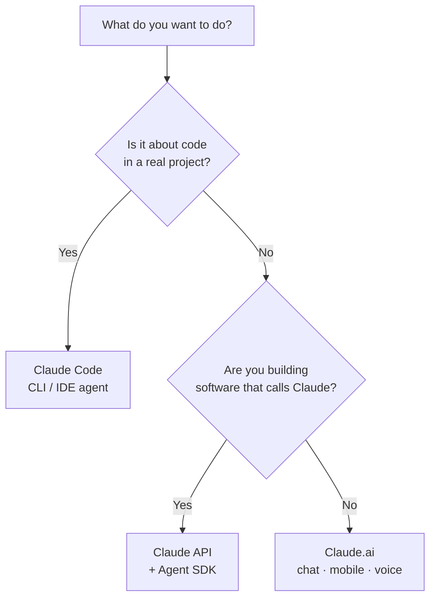

<LevelBadge level="beginner" />

"Claude"有好几种形态。按 **你想做什么** 来选，而不是按你听说过哪一个来选。

<Callout type="objectives" items={[
  "把你的目标匹配到合适的 Claude 入口：聊天、Claude Code，或 API",
  "知道移动端和语音何时派得上用场",
  "理解随着你水平的提升，这三个入口如何协同配合",
  "在你开始动手开发时，快速判断该选用哪个模型"
]} />

## 30 秒决策

## 三个入口一览

| 入口 | 最适合 | 面向谁 | 从这里开始 |
|---|---|---|---|
| **Claude.ai** | 写作、调研、分析、学习、规划、日常提问 | 所有人，无需设置 | [Claude.ai 入门](/docs/claude-app/getting-started) |
| **Claude Code** | *在代码库里* 干活——读取、编辑、运行命令、修复测试 | 开发者（以及有技术好奇心的人） | [Claude Code 是什么](/docs/claude-code/what-is-claude-code) |
| **API & Agent SDK** | 以编程方式调用 Claude 的应用、自动化和智能体 | 要发布产品或流水线的开发者 | [你的第一次 API 调用](/docs/api/first-call) |

### Claude.ai——聊天应用

Claude.ai 是面向所有人的、无需设置的起点。你还能在 **移动端**（[iOS/Android](/docs/claude-app/mobile)）和通过 **[语音](/docs/claude-app/voice-mode)** 使用它——非常适合在路上随手捕捉灵感。用 [项目](/docs/claude-app/projects)、[自定义指令](/docs/claude-app/custom-instructions) 和 [Artifacts](/docs/claude-app/artifacts) 让它更强大。

### Claude Code——智能体式编码工具

Claude Code 在你的项目 *内部* 工作。它会读取、编辑、运行命令、修复测试——在你授权的前提下对你的文件采取行动。

### API & Agent SDK——把 Claude 内建进你自己的软件

API 和 Agent SDK 让你自己的软件以编程方式调用 Claude，从而让你能够发布 AI 功能、自动化和智能体。

## 它们协同工作

这些并不是互相竞争的产品——大多数人会逐级用上它们：

| 你想…… | 用 |
|---|---|
| 起草一封邮件、总结一份 PDF、头脑风暴 | Claude.ai（或语音/移动端） |
| 重构一个模块、加测试、修一个 bug | Claude Code |
| 给 *你的* 应用加一个 AI 功能 | API / Agent SDK |

:::tip 拿不准？从聊天开始
[Claude.ai](/docs/claude-app/getting-started) 无需任何设置，并能教会你 Claude 是如何"思考"的。这些技能在其他任何地方都能迁移过去。
:::

## 等你开始开发了，该用哪个模型？

选 *入口* 是第一步。当你转向 Claude Code 或 API 时，你还要选一个 *模型*——Haiku、Sonnet 或 Opus。回答三个快速问题，这个选择器就会给你建议一个起点：

<ModelPicker />

:::note 不要把名字写死
模型阵容和价格会变。发布之前，请始终在 [选择一个 Claude 模型](/docs/api/choosing-a-model) 页面确认当前的模型 ID。
:::

## 自我检测

<Quiz title="自我检测" questions={[
  {
    q: "你想起草一封邮件并总结一份 PDF——无需任何设置。该用哪个入口？",
    options: ["Claude Code", "Claude.ai（聊天 / 移动端 / 语音）", "API & Agent SDK"],
    answer: 1,
    explain: "Claude.ai 是无需设置的聊天入口，适合写作、调研和日常提问——可在网页、移动端以及通过语音使用。"
  },
  {
    q: "你需要在一个真实项目里重构一个模块并修复失败的测试。该用哪个入口？",
    options: ["Claude.ai", "Claude Code", "API & Agent SDK"],
    answer: 1,
    explain: "Claude Code 在你的代码库内部工作——在你授权的前提下读取、编辑、运行命令并修复测试。"
  },
  {
    q: "你应该在哪里确认当前的模型名称和价格？",
    options: ["本页面", "“选择一个 Claude 模型”页面", "上面的 Mermaid 图"],
    answer: 1,
    explain: "模型阵容会变，所以本页面不会把它们写死——请到“选择一个 Claude 模型”页面查看当前的 ID 和定价。"
  }
]} />

<Callout type="takeaways" items={[
  "Claude.ai：无需设置的聊天，适合写作、调研和日常工作——也支持移动端和语音",
  "Claude Code：一个在你的代码库内部采取行动的智能体",
  "API & Agent SDK：把 Claude 内建进你自己的软件",
  "它们可以组合使用——大多数人从聊天开始，再逐级用上 Code 和 API",
  "只有在你开始开发时才去选模型（Haiku / Sonnet / Opus），并在发布前核实当前的 ID"
]} />

## 下一步

- [你的最初 5 分钟](/docs/start-here/your-first-5-minutes)
- [学习路径](/docs/start-here/learning-paths)
- [选择一个 Claude 模型](/docs/api/choosing-a-model)（等你开始动手开发时）
